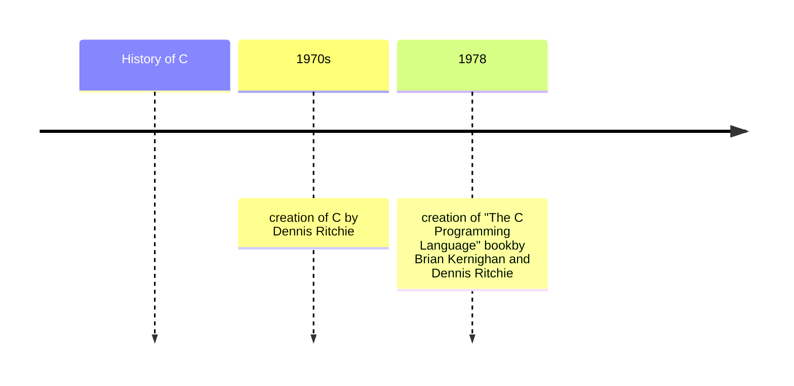

# The history of C



```mermaid

sequenceDiagram

    subgraph Early 1970s
        Origins -- Development of C begins --> 1972-1973: Development of C programming language
        1972-1973 -- Significant contributions from Dennis Ritchie --> 1978: K&R C (The C Programming Language)
    end

    subgraph 1983-1989
        1983 -- ANSI forms a committee to standardize C --> 1989: ANSI C (C89/C90) officially published
    end

    subgraph 1999
        1999 -- C99 standard is released --> 2011: C11 (revision to C standard)
    end

    subgraph 2018
        2018 -- C18 (most recent C standard) is published --> Ongoing Popularity
    end

    subgraph Ongoing Popularity
        Ongoing Popularity -- C remains a popular programming language --> Enduring Legacy
    end

    subgraph Enduring Legacy
        Enduring Legacy -- C's simple syntax and design philosophy contribute to its enduring popularity --> Modern Usage
    end

    subgraph Modern Usage
        Modern Usage -- C is often used in combination with higher-level languages and remains vital for low-level programming tasks
    end


```

# Origins: 

- Evolved from an earlier language called B, which was created by Ken Thompson.
- Written by Brian Kernighan and Dennis Ritchie in the 1970s
- C is closely tied to the development of the Unix operating system, originally implemented in ***assembly language***

# K&R C:

 The first widely used version of C was documented in "The C Programming Language" book by Brian Kernighan and Dennis Ritchie, published in 1978. This edition of C is often referred to as "K&R C."
