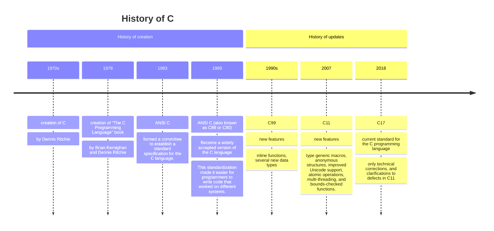
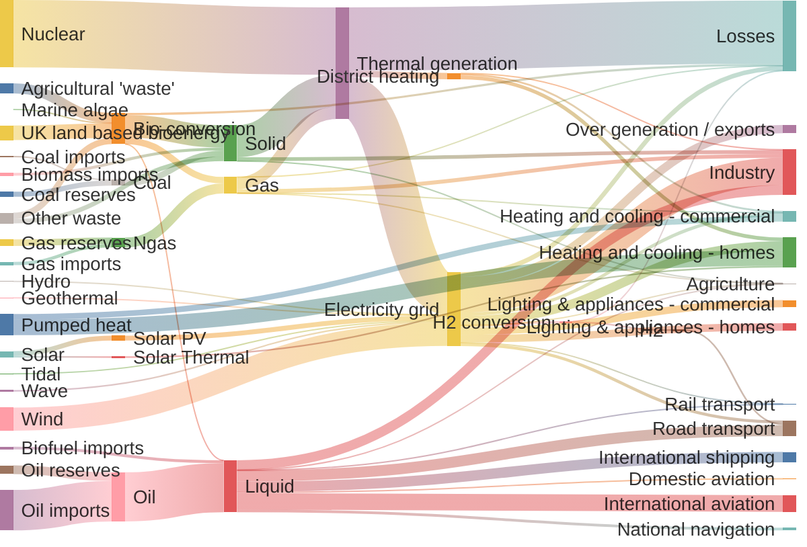

# The history of C

# Origins: 

- Evolved from an earlier language called B, which was created by Ken Thompson.
- Written by Brian Kernighan and Dennis Ritchie in the 1970s
- C is closely tied to the development of the Unix operating system, originally implemented in ***assembly language***

# K&R C:

 The first widely used version of C was documented in "The C Programming Language" book by Brian Kernighan and Dennis Ritchie, published in 1978. This edition of C is often referred to as "K&R C."

# Character set

The basic C source character set includes the following characters:

- Lowercase and uppercase letters of ISO Basic Latin Alphabet: a–z A–Z
- Decimal digits: 0–9
- Graphic characters: ! " # % & ' ( ) * + , - . / : ; < = > ? [ \ ] ^ _ { | } ~
- Whitespace characters: space, horizontal tab, vertical tab, form feed, newline