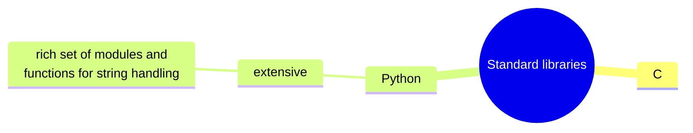

# Standard Libraries

# Python and C Standard libraries differences

```mermaid
mindmap
    root((Standard libraries))
        C
        Python
            extensive
                rich set of modules and <br> functions for string handling

```